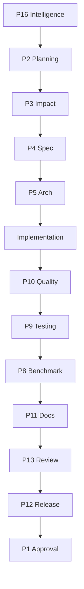

# Planning Engine

> Document ID: KCM-PLAN-001 | Version: 2.0.0 | Status: Active

## Overview

The Planning Engine creates structured, deterministic execution plans for engineering tasks. It ensures every task has a complete plan before implementation begins.

## Plan Generation Algorithm

```
1. Receive task classification from Task Analyzer
2. Receive codebase map from Repository Intelligence (P16)
3. Identify all affected components
4. Select pipeline based on task type
5. Map skills to phases
6. Identify dependencies between phases
7. Assess risks
8. Define deliverables
9. Define validation criteria
10. Generate execution plan
```

## Plan Structure

```markdown
# Execution Plan

**Task ID:** {{TASK_ID}}
**Task:** {{TASK}}
**Date:** {{DATE}}
**Planner:** P2 Task Planner
**Pipeline:** {{PIPELINE}}
**Risk Level:** {{RISK}}

## Objectives
1. {{OBJECTIVE_1}}
2. {{OBJECTIVE_2}}

## Affected Components
| Component | Files | Change Type | Risk |
|-----------|-------|-------------|------|
| {{COMPONENT}} | {{FILES}} | {{TYPE}} | {{RISK}} |

## Affected Specifications
| Spec | Update Required | Priority |
|------|----------------|----------|
| {{SPEC}} | {{YES/NO}} | {{PRIORITY}} |

## Required Skills
| Skill | Phase | Responsibility | Duration |
|-------|-------|---------------|----------|
| {{SKILL}} | {{PHASE}} | {{RESPONSIBILITY}} | {{DURATION}} |

## Execution Order


## Dependencies
| Dependency | Type | Impact | Mitigation |
|-----------|------|--------|------------|
| {{DEP}} | {{TYPE}} | {{IMPACT}} | {{MITIGATION}} |

## Risks
| Risk | Probability | Impact | Mitigation |
|------|------------|--------|------------|
| {{RISK}} | {{LOW/MED/HIGH}} | {{LOW/MED/HIGH}} | {{MITIGATION}} |

## Deliverables
| Deliverable | Type | Validator | Location |
|------------|------|-----------|----------|
| {{DELIVERABLE}} | {{TYPE}} | {{VALIDATOR}} | {{LOCATION}} |

## Validation Gates
| Gate | Validator | Pass Criteria | Blocking |
|------|-----------|--------------|----------|
| {{GATE}} | {{VALIDATOR}} | {{CRITERIA}} | {{YES/NO}} |

## Exit Criteria
- [ ] All objectives met
- [ ] All deliverables complete
- [ ] All gates passed
- [ ] All approvals received
- [ ] Documentation updated
- [ ] Tests passing
- [ ] No regressions
```

## Plan Validation

| Check | Method | Pass Criteria |
|-------|--------|--------------|
| All files identified | Grep + glob | No missing files |
| All specs identified | Spec lookup | No missing specs |
| Skills correctly routed | Routing rules | Correct skills |
| Dependencies mapped | Dependency analysis | No missing deps |
| Risks assessed | Risk matrix | All risks have mitigation |
| Deliverables defined | Deliverable check | All deliverables listed |
| Exit criteria complete | Criteria check | All criteria actionable |
| Pipeline matches type | Pipeline lookup | Correct pipeline |

## Plan Templates by Task Type

### Feature Plan
- Must include SSOT specification requirement
- Must include new test requirements
- Must include benchmark requirements
- Must include documentation requirements

### Bug Fix Plan
- Must include root cause analysis
- Must include regression test
- Must include minimal fix scope
- Must not include refactoring

### Optimization Plan
- Must include baseline benchmark
- Must include comparison benchmark
- Must include memory impact assessment
- Must include regression threshold

### Security Plan
- Must include threat assessment
- Must include security test requirements
- Must include audit trail requirements
- Must include compliance validation
