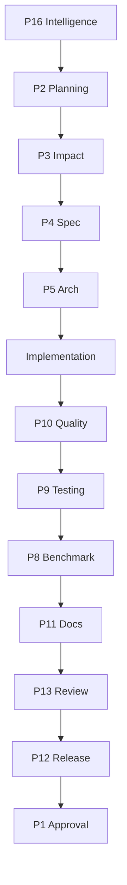

# Execution Plan Template

> Document ID: KCM-TPL-PLAN-001 | Version: 1.0.0

## Usage

Copy this template for each new task. Replace all `{{PLACEHOLDER}}` values.

---

# Execution Plan

**Task ID:** {{TASK_ID}}
**Task:** {{TASK_DESCRIPTION}}
**Date:** {{DATE}}
**Planner:** P2 Task Planner
**Pipeline:** {{PIPELINE}}
**Risk Level:** {{RISK_LEVEL}}

## Objectives

1. {{OBJECTIVE_1}}
2. {{OBJECTIVE_2}}

## Affected Components

| Component | Files | Change Type | Risk |
|-----------|-------|-------------|------|
| {{COMPONENT}} | {{FILES}} | {{TYPE}} | {{RISK}} |

## Affected Specifications

| Spec | Update Required | Priority |
|------|----------------|----------|
| {{SPEC}} | {{YES/NO}} | {{PRIORITY}} |

## Required Skills

| Skill | Phase | Responsibility | Duration |
|-------|-------|---------------|----------|
| {{SKILL}} | {{PHASE}} | {{RESPONSIBILITY}} | {{DURATION}} |

## Execution Order

## Dependencies

| Dependency | Type | Impact | Mitigation |
|-----------|------|--------|------------|
| {{DEP}} | {{TYPE}} | {{IMPACT}} | {{MITIGATION}} |

## Risks

| Risk | Probability | Impact | Mitigation |
|------|------------|--------|------------|
| {{RISK}} | {{LOW/MED/HIGH}} | {{LOW/MED/HIGH}} | {{MITIGATION}} |

## Deliverables

| Deliverable | Type | Validator | Location |
|------------|------|-----------|----------|
| {{DELIVERABLE}} | {{TYPE}} | {{VALIDATOR}} | {{LOCATION}} |

## Validation Gates

| Gate | Validator | Pass Criteria | Blocking |
|------|-----------|--------------|----------|
| {{GATE}} | {{VALIDATOR}} | {{CRITERIA}} | {{YES/NO}} |

## Exit Criteria

- [ ] All objectives met
- [ ] All deliverables complete
- [ ] All gates passed
- [ ] All approvals received
- [ ] Documentation updated
- [ ] Tests passing
- [ ] No regressions
