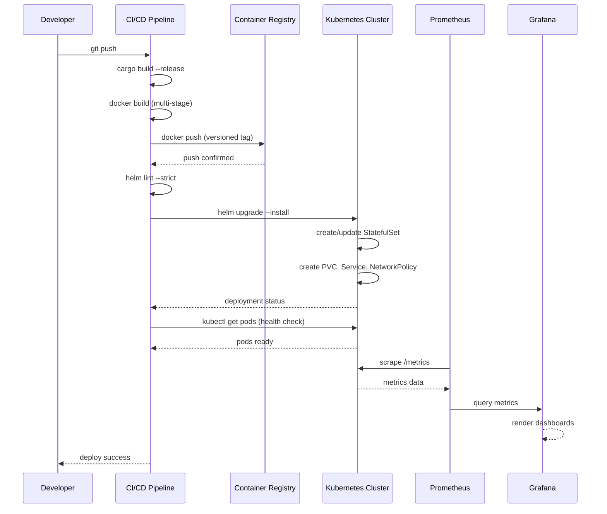
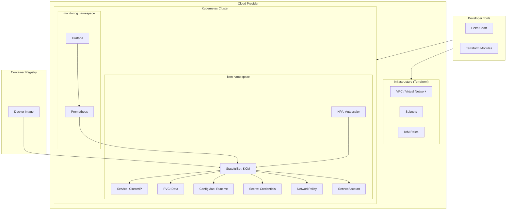

# Deployment Technical Specification

## Overview

This document defines the technical specification for deploying KCM (Knowledge Columnar Model) across Docker, Kubernetes, Helm, Terraform, Prometheus, and Grafana infrastructure. It covers container builds, orchestration, infrastructure provisioning, and observability configuration.

## Scope

The deployment specification covers:

- Docker image construction and composition
- Kubernetes workload orchestration
- Helm chart parameterization and templating
- Cloud infrastructure provisioning (AWS, Azure, GCP)
- Prometheus metrics collection and alerting
- Grafana dashboard provisioning

## Responsibilities

| Component | Owner | Responsibility |
|-----------|-------|----------------|
| Docker | Deployment Engineer | Image builds, layer optimization, security hardening |
| Kubernetes | Platform Engineer | Cluster management, namespace configuration, RBAC |
| Helm | Deployment Engineer | Chart maintenance, value management, release lifecycle |
| Terraform | Infrastructure Engineer | Cloud resource provisioning, state management, module maintenance |
| Prometheus | SRE / Monitoring Engineer | Metric collection, alert rule management, retention policies |
| Grafana | SRE / Monitoring Engineer | Dashboard provisioning, data source configuration, alert integration |

## Technical Specification

### Docker

#### Multi-Stage Build

The Dockerfile uses a multi-stage build pattern:

| Stage | Base Image | Purpose |
|-------|-----------|---------|
| Builder | `rust:1.85` | Compile KCM with full Rust toolchain |
| Runtime | `debian:bookworm-slim` | Minimal runtime with only production dependencies |

```dockerfile
# Stage 1: Build
FROM rust:1.85 AS builder
# ... compile KCM

# Stage 2: Runtime
FROM debian:bookworm-slim AS runtime
# ... install only runtime dependencies, copy binary
```

**Requirements:**
- Builder stage must compile with `--release` flag
- Runtime stage must use non-root user
- Runtime stage must not include build tools, source code, or cargo registry
- Final image must be under 200MB
- All layers must be optimized for cache efficiency

#### Docker Compose

**Single-Node Development:**
- Defines a single KCM instance with all required services
- Mounts local data directory for persistence
- Exposes KCM API port and health check endpoint
- Includes resource limits to prevent host resource exhaustion

**Monitoring Stack:**
- Deploys Prometheus with KCM scrape configuration
- Deploys Grafana with pre-provisioned dashboards
- Uses Docker networks for inter-service communication
- Includes volume definitions for persistent metric data

### Kubernetes

#### Workload Specification

KCM runs as a **StatefulSet** to ensure stable network identity and persistent storage:

| Resource | Configuration |
|----------|--------------|
| Kind | `StatefulSet` |
| Replicas | 1 (single-instance mode) |
| Service | `ClusterIP` Service for internal access |
| PVC | `PersistentVolumeClaim` for data persistence |
| ConfigMap | Runtime configuration injection |
| Secret | Sensitive configuration (credentials, keys) |
| Ingress | Optional, for external access |

#### StatefulSet Configuration

- `serviceName`: kcm-headless
- `replicas`: Configurable via Helm values (default: 1)
- `podManagementPolicy`: `OrderedReady`
- `updateStrategy`: `RollingUpdate`
- `volumeClaimTemplates`: PVC for `/data` mount

#### Service Configuration

- `type`: ClusterIP
- `port`: 8080 (API), 9090 (metrics)
- `targetPort`: Matches container port
- `selector`: Matches StatefulSet pod labels

#### Network Policies

- Default-deny ingress for the KCM namespace
- Allow ingress from monitoring namespace (Prometheus scraping)
- Allow ingress from ingress controller (external API access)
- Allow egress to DNS and required external services

### Helm

#### Chart Structure

```
helm/
├── Chart.yaml          # Chart metadata
├── values.yaml         # Default values
├── templates/
│   ├── _helpers.tpl    # Template helpers
│   ├── statefulset.yaml
│   ├── service.yaml
│   ├── pvc.yaml
│   ├── configmap.yaml
│   ├── secret.yaml
│   ├── networkpolicy.yaml
│   ├── hpa.yaml
│   ├── serviceaccount.yaml
│   └── NOTES.txt
└── README.md
```

#### values.yaml Parameterization

```yaml
replicaCount: 1
image:
  repository: kcm/kcm
  tag: "latest"
  pullPolicy: IfNotPresent
service:
  type: ClusterIP
  port: 8080
resources:
  requests:
    cpu: 100m
    memory: 128Mi
  limits:
    cpu: 1000m
    memory: 1Gi
persistence:
  enabled: true
  size: 10Gi
  storageClass: standard
monitoring:
  enabled: true
  port: 9090
  path: /metrics
```

### Terraform

#### Module Structure

```
terraform/
├── modules/
│   ├── aws/        # AWS EKS provisioning
│   ├── azure/      # Azure AKS provisioning
│   └── gcp/        # GCP GKE provisioning
├── environments/
│   ├── dev/        # Development environment
│   ├── staging/    # Staging environment
│   └── prod/       # Production environment
└── shared/         # Shared resources (VPC, networking)
```

#### Cloud Provider Modules

| Provider | Service | Purpose |
|----------|---------|---------|
| AWS | EKS | Managed Kubernetes cluster |
| Azure | AKS | Managed Kubernetes cluster |
| GCP | GKE | Managed Kubernetes cluster |

#### Terraform Variables

```hcl
variable "cluster_name" {
  type        = string
  description = "Name of the Kubernetes cluster"
}

variable "cluster_version" {
  type        = string
  description = "Kubernetes version"
  default     = "1.29"
}

variable "node_count" {
  type        = number
  description = "Number of worker nodes"
  default     = 3
}

variable "node_machine_type" {
  type        = string
  description = "Machine type for worker nodes"
  default     = "m5.large"
}
```

### Prometheus

#### Alerting Rules

```yaml
groups:
  - name: kcm-alerts
    rules:
      - alert: KCMHighErrorRate
        expr: rate(kcm_errors_total[5m]) > 0.05
        for: 5m
        labels:
          severity: critical
        annotations:
          summary: "KCM error rate exceeds 5%"

      - alert: KCMHighLatency
        expr: histogram_quantile(0.99, rate(kcm_query_duration_seconds_bucket[5m])) > 0.5
        for: 5m
        labels:
          severity: warning
        annotations:
          summary: "KCM P99 query latency exceeds 500ms"

      - alert: KCMWALLag
        expr: kcm_wal_lag_bytes > 10485760
        for: 5m
        labels:
          severity: warning
        annotations:
          summary: "KCM WAL lag exceeds 10MB"

      - alert: KCMCacheHitRatioLow
        expr: kcm_cache_hit_ratio < 0.5
        for: 10m
        labels:
          severity: warning
        annotations:
          summary: "KCM cache hit ratio below 50%"
```

#### Scrape Configuration

```yaml
scrape_configs:
  - job_name: 'kcm'
    static_configs:
      - targets: ['kcm:9090']
    metrics_path: /metrics
    scrape_interval: 15s
```

### Grafana

#### Dashboard Provisioning

Grafana dashboards are provisioned via configuration files in `grafana/provisioning/`:

| Dashboard | Panels | Purpose |
|-----------|--------|---------|
| KCM Overview | Queries, inserts, cache hit ratio, memory usage | High-level system health |
| KCM Query Performance | Latency histograms, throughput, error rates | Query engine performance |
| KCM Storage | WAL lag, disk usage, compression ratio | Storage engine health |
| KCM Inference | Inference count, rule execution, facts inferred | Reasoning engine metrics |

#### Data Source Configuration

```yaml
apiVersion: 1
datasources:
  - name: Prometheus
    type: prometheus
    access: proxy
    url: http://prometheus:9090
    isDefault: true
    editable: false
```

## Architecture

```
┌─────────────────────────────────────────────────────────────┐
│                    Cloud Infrastructure                      │
│  ┌──────────────┐  ┌──────────────┐  ┌──────────────┐      │
│  │  AWS EKS     │  │  Azure AKS   │  │  GCP GKE     │      │
│  └──────┬───────┘  └──────┬───────┘  └──────┬───────┘      │
│         └──────────────────┼──────────────────┘              │
│                            │                                 │
│                    ┌───────▼───────┐                        │
│                    │  Kubernetes   │                        │
│                    │  Namespace    │                        │
│                    └───────┬───────┘                        │
│                            │                                 │
│    ┌───────────────────────┼───────────────────────┐       │
│    │                       │                       │       │
│  ┌─▼──────────┐  ┌────────▼────────┐  ┌──────────▼─┐    │
│  │  StatefulSet│  │  Prometheus     │  │  Grafana   │    │
│  │  (KCM)      │  │  (Monitoring)   │  │  (Dashboards)│  │
│  └─┬──────────┘  └────────┬────────┘  └──────────┬─┘    │
│    │                       │                       │       │
│  ┌─▼──────────┐  ┌────────▼────────┐              │       │
│  │  PVC        │  │  Alert Rules    │              │       │
│  │  (Data)     │  │  (Alerting)     │              │       │
│  └────────────┘  └─────────────────┘              │       │
└─────────────────────────────────────────────────────────────┘
```

## Internal Components

### Docker (`deployment/Dockerfile`)

Multi-stage build producing a minimal runtime image. Builder stage compiles KCM from source; runtime stage contains only the compiled binary and runtime dependencies.

### Docker Compose (`deployment/docker-compose.yml`)

Single-node development environment. Mounts local data directory, exposes API port, includes resource limits.

### Docker Compose Monitoring (`deployment/docker-compose.monitoring.yml`)

Extends the base compose file with Prometheus and Grafana services. Used for local development and testing of monitoring configurations.

### Helm Chart (`deployment/helm/`)

Kubernetes Helm chart for KCM deployment. Parameterized via `values.yaml` with sensible defaults. Supports all Kubernetes resource types required for a production deployment.

### Kubernetes Manifests (`deployment/k8s/`)

Raw Kubernetes manifests for direct deployment without Helm. Includes StatefulSet, Service, PVC, ConfigMap, Secret, NetworkPolicy, and HPA definitions.

### Terraform Modules (`deployment/terraform/`)

Infrastructure-as-Code modules for AWS, Azure, and GCP. Each module provisions a managed Kubernetes cluster with appropriate networking, IAM, and storage configurations.

### Prometheus Configuration (`deployment/prometheus/`)

Prometheus scrape configurations, alerting rules, and recording rules. Defines KCM-specific metrics collection and alerting thresholds.

### Grafana Provisioning (`deployment/grafana/`)

Grafana data source configurations and dashboard provisioning files. Pre-configured dashboards for KCM system health, query performance, storage, and inference monitoring.

## Data Model

### Helm Values

| Key | Type | Default | Description |
|-----|------|---------|-------------|
| `replicaCount` | int | 1 | Number of KCM replicas |
| `image.repository` | string | `kcm/kcm` | Container image repository |
| `image.tag` | string | `latest` | Container image tag |
| `image.pullPolicy` | string | `IfNotPresent` | Image pull policy |
| `service.type` | string | `ClusterIP` | Kubernetes service type |
| `service.port` | int | 8080 | API service port |
| `resources.requests.cpu` | string | `100m` | CPU request |
| `resources.requests.memory` | string | `128Mi` | Memory request |
| `resources.limits.cpu` | string | `1000m` | CPU limit |
| `resources.limits.memory` | string | `1Gi` | Memory limit |
| `persistence.enabled` | bool | `true` | Enable persistent storage |
| `persistence.size` | string | `10Gi` | PVC size |
| `persistence.storageClass` | string | `standard` | Storage class |
| `monitoring.enabled` | bool | `true` | Enable metrics endpoint |
| `monitoring.port` | int | 9090 | Metrics port |
| `monitoring.path` | string | `/metrics` | Metrics path |

### Terraform Variables

| Variable | Type | Default | Description |
|----------|------|---------|-------------|
| `cluster_name` | string | (required) | Name of the Kubernetes cluster |
| `cluster_version` | string | `1.29` | Kubernetes version |
| `node_count` | number | `3` | Number of worker nodes |
| `node_machine_type` | string | `m5.large` | Machine type for worker nodes |
| `region` | string | (required) | Cloud provider region |
| `environment` | string | `dev` | Deployment environment |

## Execution Flow

### Build → Push → Deploy

```
1. Build
   ├── cargo build --release (compile KCM binary)
   ├── docker build (multi-stage, build + runtime)
   └── docker tag (semantic version tag)

2. Push
   ├── docker push (to private registry)
   └── registry scan (CVE check)

3. Deploy
   ├── helm upgrade --install (Kubernetes)
   ├── terraform apply (infrastructure)
   └── verify health check (post-deploy validation)
```

### Detailed Sequence

```
Developer → CI/CD Pipeline → Registry → Kubernetes → Prometheus → Grafana
    │              │              │            │            │            │
    │  git push    │              │            │            │            │
    ├─────────────►│              │            │            │            │
    │              │  docker build│            │            │            │
    │              ├─────────────►│            │            │            │
    │              │  docker push │            │            │            │
    │              ├─────────────►│            │            │            │
    │              │  helm deploy │            │            │            │
    │              ├──────────────┼───────────►│            │            │
    │              │              │            │  scrape    │            │
    │              │              │            ├───────────►│            │
    │              │              │            │            │  query     │
    │              │              │            │            ├───────────►│
    │              │  health check│            │            │            │
    │              ├──────────────┼───────────►│            │            │
    │              │  verify OK   │            │            │            │
    │◄─────────────┤              │            │            │            │
```

## Public API

### Environment Variables

| Variable | Default | Description |
|----------|---------|-------------|
| `KCM_DATA_DIR` | `/data` | Path to KCM data directory |
| `KCM_API_PORT` | `8080` | API server listening port |
| `KCM_METRICS_PORT` | `9090` | Prometheus metrics port |
| `KCM_LOG_LEVEL` | `info` | Logging level (`error`, `warn`, `info`, `debug`, `trace`) |
| `KCM_DB_NAME` | `knowledge.db` | Database filename |
| `KCM_WAL_ENABLED` | `true` | Enable write-ahead logging |
| `KCM_CACHE_SIZE_MB` | `256` | Query cache size in megabytes |
| `KCM_THREAD_POOL_SIZE` | (CPU count) | Rayon thread pool size |
| `KCM_ENCRYPTION_ENABLED` | `false` | Enable AES-256-GCM encryption at rest |
| `KCM_ENCRYPTION_KEY` | (none) | Encryption key (hex-encoded 32 bytes) |
| `KCM_PROMETHEUS_ENABLED` | `true` | Enable Prometheus metrics endpoint |
| `KCM_PROMETHEUS_PATH` | `/metrics` | Prometheus metrics path |
| `KCM_HEALTH_CHECK_PATH` | `/health` | Health check endpoint path |

## Configuration

All environment variables have defaults and are optional unless noted. Configuration can be provided via:

1. **Environment variables** (highest priority)
2. **ConfigMap** (Kubernetes)
3. **values.yaml** (Helm)
4. **Default values** (lowest priority)

Sensitive configuration (encryption keys, credentials) must be provided via Kubernetes Secrets, Helm secrets, or external secret management — never via ConfigMap or plaintext values.

## Dependencies

| Dependency | Type | Justification |
|------------|------|---------------|
| Rust 1.85 | Build | Required for KCM compilation |
| debian:bookworm-slim | Runtime | Minimal base for production image |
| Kubernetes | Runtime | Container orchestration |
| Helm | Build/Deploy | Chart templating and release management |
| Terraform | Build | Cloud infrastructure provisioning |
| Prometheus | Runtime | Metrics collection and alerting |
| Grafana | Runtime | Dashboard visualization |
| Private Container Registry | Build | Image storage and distribution |

## Error Handling

| Error | Response | Recovery |
|-------|----------|----------|
| Docker build failure | CI pipeline fails, notification sent | Fix build error, re-push |
| Image pull failure | Pod in `ImagePullBackOff` | Check registry access, image tag |
| PVC bind failure | Pod in `Pending` | Check storage class, available capacity |
| Health check failure | Pod restarted by liveness probe | Check logs, fix application error |
| Prometheus scrape failure | Missing metrics in Grafana | Check network policy, service endpoint |
| Helm release failure | Release in `FAILED` state | `helm rollback` to previous revision |
| Terraform apply failure | State lock or plan error | Release state lock, fix configuration |

## Performance Characteristics

| Metric | Target | Measurement |
|--------|--------|-------------|
| Docker image size | < 200MB | `docker images` |
| Container startup | < 5s | Time from `docker start` to health check pass |
| Helm chart render | < 2s | `helm template` execution time |
| Terraform plan | < 60s | `terraform plan` execution time |
| Prometheus scrape | < 1s | Scrape duration metric |
| Grafana dashboard load | < 3s | Time to render all panels |

## Security Considerations

### Container Security

- All containers run as non-root user (UID > 0)
- Read-only root filesystem where possible
- All Linux capabilities dropped except required
- Seccomp profiles applied
- No privileged mode

### Network Policies

- Default-deny ingress for all namespaces
- Explicit allow rules for required communication paths
- Egress restricted to known destinations
- No unrestricted pod-to-pod communication

### Secrets Management

- No hardcoded credentials in any configuration file
- Kubernetes secrets for application credentials
- Sealed secrets or external secret operator for Git-safe storage
- Terraform sensitive variables marked with `sensitive = true`
- Regular secret rotation (90-day cycle)

## Integration

The deployment infrastructure integrates with:

| System | Integration Point | Protocol |
|--------|-------------------|----------|
| CI/CD Pipeline | Build and deploy trigger | Git webhook |
| Container Registry | Image storage | HTTPS |
| Kubernetes API | Workload management | HTTPS/gRPC |
| Prometheus | Metrics scraping | HTTP |
| Grafana | Dashboard rendering | HTTP |
| Vault / Cloud Secrets | Secret injection | HTTPS |
| Cloud Provider APIs | Infrastructure provisioning | HTTPS |

## Sequence Diagram (Deployment Flow)



## Architecture Diagram



## References

- [SSOT: docs/PRD3.md §33](../../PRD3.md) — Deployment architecture specification
- [SSOT: docs/specs/KCM_DEPLOYMENT_SPEC.md](../specs/KCM_DEPLOYMENT_SPEC.md) — Deployment technical specification
- [SSOT: SSOT.md](../../SSOT.md) — Single Source of Truth index
- [AGENTS.md](../../AGENTS.md) — Engineering constitution
- [Docker Multi-Stage Builds](https://docs.docker.com/build/building/multi-stage/)
- [Kubernetes StatefulSets](https://kubernetes.io/docs/concepts/workloads/controllers/statefulset/)
- [Helm Charts](https://helm.sh/docs/chart_best_practices/)
- [Terraform Modules](https://developer.hashicorp.com/terraform/language/modules)
- [Prometheus Alerting](https://prometheus.io/docs/prometheus/latest/configuration/alerting_rules/)
- [Grafana Provisioning](https://grafana.com/docs/grafana/latest/administration/provisioning/)

## SSOT Alignment

This specification is aligned with the following SSOT documents:

| SSOT Document | Section | Alignment |
|---------------|---------|-----------|
| `docs/PRD3.md` | §33 | Deployment architecture and infrastructure requirements |
| `docs/specs/KCM_DEPLOYMENT_SPEC.md` | All | Complete deployment technical specification |
| `AGENTS.md` | Engineering Constitution | Build/test commands, dependency policy, error model |
| `SSOT.md` | Document Hierarchy | Authority and priority of specifications |

All implementation details in this document must match the authoritative SSOT specifications. When this document conflicts with the SSOT, the SSOT takes precedence per SSOT-05.
