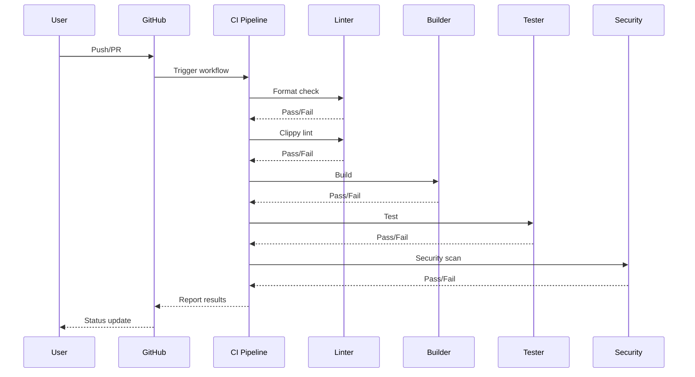
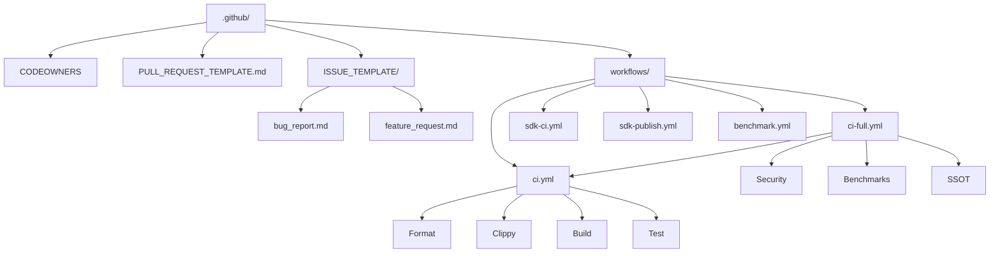

# GitHub Configuration Technical Specification

## Overview

Technical specification for the `.github/` directory, defining CI/CD pipelines, issue templates, code ownership, and PR workflows.

## Scope

| Component | Scope |
|-----------|-------|
| CI/CD | GitHub Actions workflows |
| Issue Management | Bug report and feature request templates |
| Code Ownership | CODEOWNERS rules |
| PR Workflow | Pull request template and review process |

## Responsibilities

| Responsibility | Description |
|----------------|-------------|
| CI/CD | Automated testing, linting, building |
| Issue Management | Standardized issue reporting |
| Code Ownership | Code review assignment |
| PR Workflow | Standardized PR process |

## Technical Specification

### CI Pipeline

```
Format → Clippy → Build → Test → Security → Benchmarks → SSOT Validation
```

| Stage | Tool | Command | Description |
|-------|------|---------|-------------|
| Format | rustfmt | `cargo fmt --all -- --check` | Code formatting check |
| Clippy | clippy | `cargo clippy --workspace -- -D warnings` | Linting and code quality |
| Build | cargo | `cargo build --release --workspace` | Compilation |
| Test | cargo | `cargo test --workspace` | Unit, integration, property tests |
| Security | custom | Security test suite | Security validation |
| Benchmarks | criterion | `cargo bench --workspace` | Performance benchmarks |
| SSOT | custom | `bash scripts/validate-ssot.sh` | Specification compliance |

### SDK CI

| Language | Checks |
|----------|--------|
| Python | Lint, type check, test |
| Rust | Clippy, test |
| C/C++ | Compile, test |

### SDK Publish

| Step | Description |
|------|-------------|
| Version check | Verify version bump |
| Build | Compile for target platforms |
| Publish | Push to package registry |
| Tag | Create git tag |

### CODEOWNERS

| Pattern | Owner | Description |
|---------|-------|-------------|
| `*` | @kcm/engineering | Default ownership |
| `.github/` | @kcm/devops | CI/CD configuration |
| `crates/kcm-core/` | @kcm/core | Core engine |
| `crates/kcm-security/` | @kcm/security | Security module |

### Issue Templates

| Template | Fields |
|----------|--------|
| bug_report.md | Description, steps, expected, actual, environment |
| feature_request.md | Problem, solution, alternatives, context |

## Architecture

```
.github/
├── CODEOWNERS
├── PULL_REQUEST_TEMPLATE.md
├── ISSUE_TEMPLATE/
│   ├── bug_report.md
│   └── feature_request.md
└── workflows/
    ├── ci.yml
    ├── ci-full.yml
    ├── sdk-ci.yml
    ├── sdk-publish.yml
    └── benchmark.yml
```

## Internal Components

| Component | File | Description |
|-----------|------|-------------|
| CI Pipeline | ci.yml | Format, clippy, build, test |
| Full CI | ci-full.yml | CI + security + benchmarks + SSOT |
| SDK CI | sdk-ci.yml | SDK-specific checks |
| SDK Publish | sdk-publish.yml | SDK release pipeline |
| Benchmarks | benchmark.yml | Performance benchmarking |
| CODEOWNERS | CODEOWNERS | Code review assignment |
| PR Template | PULL_REQUEST_TEMPLATE.md | PR description template |
| Bug Template | ISSUE_TEMPLATE/bug_report.md | Bug report template |
| Feature Template | ISSUE_TEMPLATE/feature_request.md | Feature request template |

## Data Model

### Workflow Triggers

| Trigger | Workflow | Condition |
|---------|----------|-----------|
| push | ci.yml | All branches |
| pull_request | ci.yml | All branches |
| push | ci-full.yml | main branch only |
| schedule | benchmark.yml | Weekly |
| workflow_dispatch | benchmark.yml | Manual |
| release | sdk-publish.yml | Release created |

### Job Dependencies

| Workflow | Jobs | Dependencies |
|----------|------|-------------|
| ci.yml | format → clippy → build → test | Sequential |
| ci-full.yml | ci → security → benchmarks → ssot | Sequential |
| sdk-ci.yml | python → rust → c | Parallel |
| sdk-publish.yml | build → publish → tag | Sequential |

## Execution Flow

### CI Pipeline Flow

```
Trigger (push/PR)
  ↓
Format Check (rustfmt)
  ↓
Clippy Lint (clippy)
  ↓
Build (cargo build)
  ↓
Test (cargo test)
  ↓
Security Tests
  ↓
SSOT Validation
  ↓
Pass/Fail
```

### PR Merge Flow

```
PR Created
  ↓
CI Pipeline Runs
  ↓
Code Review (CODEOWNERS)
  ↓
Status Checks Pass
  ↓
Merge
  ↓
Post-Merge CI
```

## Public API

| Workflow | Command | Description |
|----------|---------|-------------|
| ci.yml | `cargo fmt --all -- --check` | Format check |
| ci.yml | `cargo clippy --workspace -- -D warnings` | Lint check |
| ci.yml | `cargo build --release --workspace` | Build |
| ci.yml | `cargo test --workspace` | Test |
| ci-full.yml | `bash scripts/validate-ssot.sh` | SSOT validation |
| benchmark.yml | `cargo bench --workspace` | Benchmarks |

## Configuration

### GitHub Actions Secrets

| Secret | Purpose | Environment |
|--------|---------|-------------|
| CI_TOKEN | GitHub API token | All workflows |
| PUBLISH_TOKEN | Package registry token | SDK publish |
| BENCHMARK_TOKEN | Benchmark reporting | Benchmarks |

## Dependencies

- Workspace `Cargo.toml` for Rust toolchain
- GitHub Actions runner environments
- External GitHub Actions (pinned to specific versions)

## Error Handling

| Error | Handling |
|-------|----------|
| Format failure | Block merge, report diff |
| Clippy warning | Block merge, report warning |
| Build failure | Block merge, report error |
| Test failure | Block merge, report failure |
| Security failure | Block merge, report vulnerability |
| Benchmark regression | Report, do not block |

## Performance Characteristics

| Metric | Target |
|--------|--------|
| CI pipeline duration | < 15 minutes |
| Full CI duration | < 30 minutes |
| SDK CI duration | < 10 minutes |
| Benchmark duration | < 60 minutes |

## Security Considerations

| Consideration | Implementation |
|---------------|----------------|
| Workflow permissions | Least-privilege per workflow |
| Action versions | Pinned to specific SHA |
| Secret isolation | Separate secrets per environment |
| Branch protection | Required reviews, status checks |

## Integration

| System | Integration |
|--------|-------------|
| GitHub Actions | CI/CD execution |
| GitHub API | Workflow management |
| Package registries | SDK publishing |
| Benchmarking | Performance tracking |

## Sequence Diagram

### CI Pipeline



## Architecture Diagram



## References

- [GitHub Actions Documentation](https://docs.github.com/en/actions)
- [CODEOWNERS](https://docs.github.com/en/repositories/managing-your-repositorys-settings-and-features/customizing-your-repository/about-code-owners)
- Workspace `Cargo.toml`

## SSOT Alignment

| Specification | SSOT Document | Status |
|---------------|---------------|--------|
| CI Pipeline | PRD-TESTING§1-8 | Aligned |
| Error Model | PRD.md§3 | Aligned |
| Testing Strategy | PRD-TESTING§4 | Aligned |
| Benchmark Targets | PRD-TESTING§4 | Aligned |
| Security Requirements | PRD3.md§30 | Aligned |
